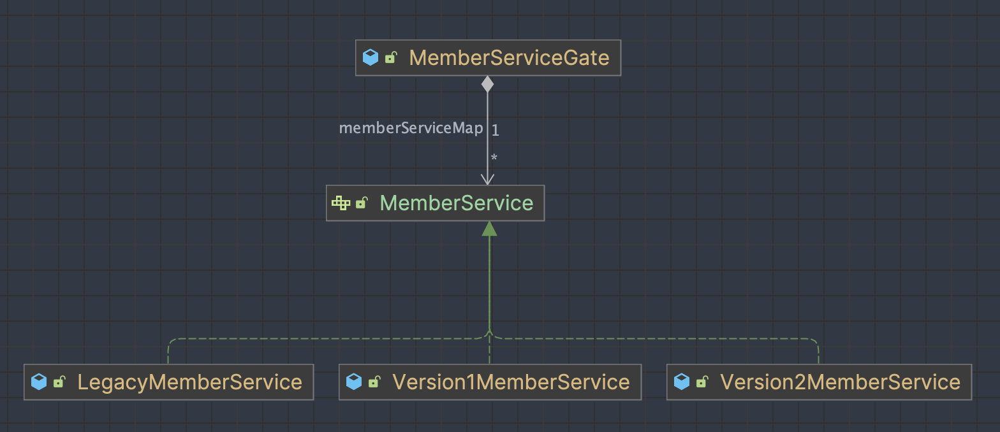
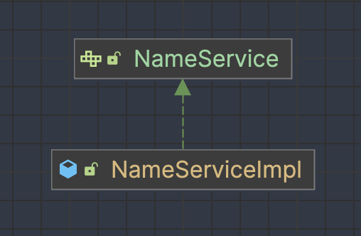

# feature-toggles

## Getting started

***

## Description
> Feature Toggle적용을 위한 스프링부트 백엔드 코드에서의 적용 튜토리얼을 제공합니다.    

### Strategy Pattern을 사용한 예시
> member도메인 참고해주세요.
   - Gate 인터페이스 1개
   - 별도의 Composition 클래스 1개 출현
   - 구현 클래스 n개
   - 메소드 1개 (Gate 인터페이스에 여러개 출현되지 않음.)

### 인터페이스의 default메소드를 통한 토글 (Ignored)
> 비추
- Gate 인터페이스 1개
- 구현 클래스 1개
- 메소드가 버전별로 출현됨     
  

***

## Usage
- 사용예시는 member, payment도메인 소스 코드 참고
- 토글 대상 인스턴스 빈의 comepostion과 toggle된 인스턴스를 가져오는 상세한 내용은 [FeatureOrchestration](./src/main/java/com/example/demo/feature/FeatureOrchestration.java)의 javaDoc을 참고해주십시오.

## Glossary
- Feature Toggles   
[martinfowler's article](https://martinfowler.com/articles/feature-toggles.html)
- Feature    
토글을 위한 대상 기능을 의미
- Gate    
  기능을 수행하는 클래스의 캡슐화를 깨지 않으면서 특정 기능의 활성화 여부를 결정하는 역할을 수행합니다.

## Roadmap
- [x] Feature Toggle 기능에 대한 튜토리얼 제공
- [x] 설명 문서 작성

## Contributing
Welcome!!
## License
MIT
## Project status
Draft
